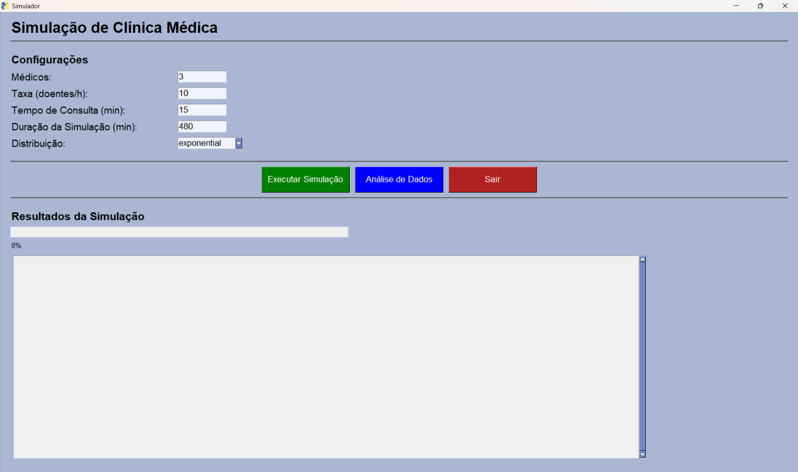
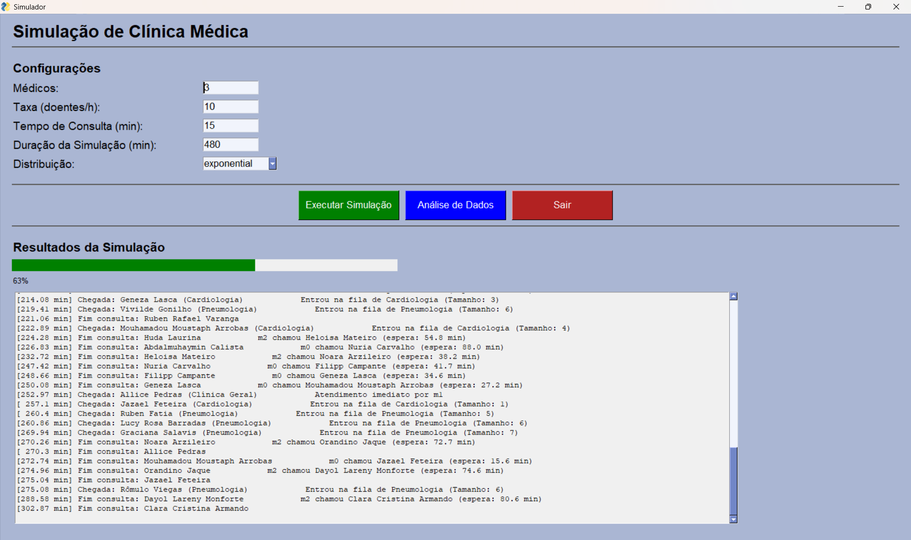
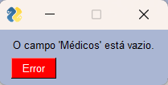
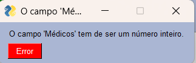
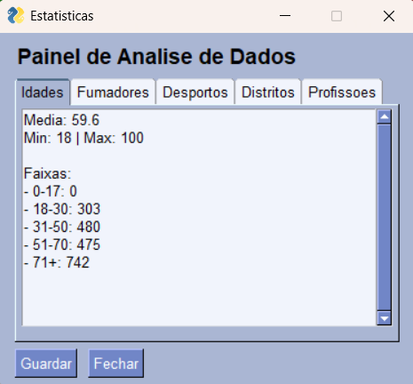
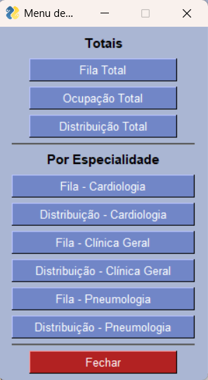

# Relatório do Projeto: Simulação de uma Clínica Médica

## Autores

Bárbara Jacques, a109722

Esmeralda Freitas, a109932

Martim Rocha, a112252

## Data

29 de dezembro de 2025

## Enquadramento Institucional

**Instituição:** Universidade do Minho – Escola de Engenharia

**Curso:** Licenciatura em Engenharia Biomédica (2.º ano)

**Unidade Curricular:** Algoritmos e Técnicas de Programação

**Projeto laboratorial idealizado e coordenado por:** José Carlos Ramalho e Luís Filipe Cunha

## Visão Geral do Projeto

No âmbito da unidade curricular de Algoritmos e Técnicas de Programação, foi proposto o desenvolvimento de uma aplicação em Python destinada à **simulação do funcionamento de uma clínica médica**. O objetivo principal do projeto consiste em modelar, de forma realista, o atendimento de doentes numa clínica, recorrendo a processos probabilísticos e a uma simulação de eventos discretos.

A aplicação permite analisar o impacto de diferentes parâmetros, tais como a taxa de chegada de doentes, o número de médicos disponíveis e o tempo médio de consulta, no desempenho global do sistema.

## Objetivos do Sistema

Os principais objetivos do sistema desenvolvido são:

* Simular a chegada de doentes a uma clínica médica segundo uma distribuição de Poisson;
* Simular o atendimento médico com tempos de consulta aleatórios, seguindo distribuições estatísticas apropriadas;
* Registar métricas de desempenho como tempos de espera, tamanho da fila e ocupação dos médicos;
* Gerar gráficos que representem a evolução desses indicadores ao longo do tempo;
* Permitir a variação dos parâmetros da simulação e a análise do impacto dessas alterações nos resultados.

## Descrição do Funcionamento do Sistema

O funcionamento básico da simulação segue o seguinte fluxo:

* Os doentes chegam à clínica de forma aleatória, de acordo com uma distribuição de Poisson com parâmetro λ;
* Caso exista um médico disponível, o doente é atendido de imediato;
* Caso contrário, o doente entra numa fila de espera (queue);
* O tempo de consulta é gerado aleatoriamente, seguindo uma distribuição exponencial, normal ou uniforme;
* Após o término da consulta, o doente abandona a clínica e o médico fica disponível para atender outro doente.

Todo o sistema é baseado numa **simulação de eventos discretos**, onde os principais eventos são a chegada e a saída de doentes.

## Parâmetros de Configuração

A aplicação permite configurar diversos parâmetros relevantes para a simulação, entre os quais:

* Taxa de chegada de doentes (doentes por hora);
* Número de médicos disponíveis;
* Tipo de distribuição do tempo de consulta;
* Tempo médio de consulta;
* Duração total da simulação.

Estes parâmetros podem ser alterados de modo a testar diferentes cenários e analisar o comportamento do sistema.

## Resultados Produzidos

Durante a execução da simulação, são recolhidos diversos indicadores de desempenho, nomeadamente:

* Tempo médio de espera dos doentes;
* Tempo médio de consulta;
* Tempo médio total de permanência na clínica;
* Tamanho médio e máximo da fila de espera;
* Percentagem de ocupação dos médicos;
* Número total de doentes atendidos.

## Gráficos Gerados

Com base nos dados recolhidos, a aplicação gera vários gráficos, entre os quais:

* Evolução do tamanho da fila de espera ao longo do tempo;
* Evolução da taxa de ocupação dos médicos ao longo da simulação;
* Relação entre a taxa de chegada de doentes e o tamanho médio da fila de espera;
* Outros gráficos adicionais considerados relevantes para a análise do sistema.

## Interface Gráfica

A aplicação dispõe de uma interface gráfica desenvolvida com o módulo **SimpleGUI**, permitindo:

* Executar a simulação;
* Alterar os parâmetros do sistema;
* Visualizar os gráficos gerados;
* (Funcionalidade extra) Visualizar graficamente a fila de espera e a ocupação dos consultórios.

A interface foi concebida de forma a facilitar a interação do utilizador com a simulação e a interpretação dos resultados obtidos.

### 1. Configuração da Simulação (Pré-Simulação)

Na fase inicial, o utilizador tem acesso a uma janela de configuração onde pode definir os principais parâmetros da simulação, tais como a taxa de chegada de doentes, o número de médicos disponíveis e a duração média das consultas. Estes parâmetros são fundamentais para caracterizar o comportamento do sistema e influenciam diretamente os resultados obtidos.

<p align="center">
  
  <br>
  <em>Figura 1: Janela de configuração inicial da simulação.</em>
</p>


Antes de iniciar a simulação, são efetuadas validações automáticas aos dados introduzidos, garantindo que todos os campos obrigatórios se encontram preenchidos e que os valores inseridos são compatíveis com o tipo esperado.

---

### 2. Execução da Simulação

Após a correta configuração dos parâmetros, o utilizador pode dar início à simulação. Durante esta fase, o sistema processa os eventos de chegada e atendimento dos doentes de acordo com os modelos probabilísticos definidos.

<p align="center">
  
  <br>
  <em>Figura 2: Barra de progresso durante a execução da simulação.</em>
</p>


Para fornecer feedback contínuo ao utilizador, é apresentada uma barra de progresso que indica o estado de execução da simulação, permitindo acompanhar visualmente a sua evolução.

---

### 3. Tratamento de Erros e Validação de Dados

Com o objetivo de aumentar a robustez da aplicação, foram implementados mecanismos de tratamento de erros. Sempre que o utilizador insere dados inválidos, como campos vazios ou valores não numéricos, o sistema apresenta mensagens de aviso claras, orientando o utilizador para a correção do erro.

<p align="center">
  
  
  <br>
  <em>Figura 3: Exemplos de mensagens de erro apresentadas ao utilizador.</em>
</p>


---

### 4. Análise de Dados

Após a conclusão da simulação, o utilizador pode aceder à janela de análise de dados, onde são apresentadas estatísticas relevantes sobre os doentes atendidos e o desempenho do sistema. Esta análise inclui, entre outros aspetos, a distribuição etária, a identificação de perfis de risco e informações gerais sobre a população simulada.

<p align="center">
  
  <br>
  <em>Figura 4: Janela de análise de dados demográficos da simulação.</em>
</p>


---

### 5. Visualização Gráfica dos Resultados

A aplicação disponibiliza ainda um menu dedicado à visualização gráfica dos resultados obtidos. Através deste menu, o utilizador pode selecionar diferentes gráficos que representam métricas importantes, como a evolução da fila de espera, o número de doentes atendidos ou o desempenho por especialidade.

<p align="center">
  
  <br>
  <em>Figura 5: Menu de seleção de gráficos estatísticos.</em>
</p>


Após a seleção, o gráfico correspondente é gerado e apresentado numa nova janela, facilitando a interpretação visual dos resultados da simulação.

<p align="center">
  <!-- INSERIR AQUI IMAGEM DE UM GRÁFICO GERADO -->
  <em>Figura 6: Exemplo de gráfico gerado a partir dos resultados da simulação.</em>
</p>

---

Em conjunto, estas funcionalidades tornam a interface gráfica uma componente essencial do sistema, permitindo não só a configuração e execução da simulação, mas também uma análise clara e estruturada dos resultados obtidos.

## Integração de Dados Reais de Doentes

Para tornar a simulação mais realista e alinhada com um contexto clínico real, foi integrada a utilização de um **dataset de pessoas em formato JSON**, fornecido no âmbito do projeto. Em vez de trabalhar apenas com identificadores abstratos de doentes, o sistema passa a lidar com pessoas reais, caracterizadas por atributos demográficos e comportamentais.

### Exemplo de Estrutura do Dataset JSON

O ficheiro JSON utilizado contém uma lista de pessoas, onde cada elemento representa um possível doente da clínica. Cada registo inclui informação como nome, idade, morada, hábitos de saúde e outros atributos relevantes. Um excerto simplificado do dataset é apresentado de seguida:

```json
{
  "nome": "Neyanne Sampaio",
  "idade": 47,
  "sexo": "feminino",
  "morada": {
    "cidade": "Ferreira do Alentejo",
    "distrito": "Beja"
  },
  "profissao": "Programador de aplicações",
  "desportos": ["Peteca", "Rugby de praia"],
  "atributos": {
    "fumador": true,
    "gosta_musica": true,
    "comida_favorita": "vegetariana"
  },
  "id": "p0"
}
```

### Carregamento e Validação dos Dados

O carregamento do dataset é realizado através de uma função dedicada, responsável por ler o ficheiro JSON e devolver a lista de pessoas a utilizar na simulação:

```python
import json

def carregar_e_validar(caminho):
    """Carrega o JSON e devolve a lista de pessoas."""
    with open(caminho, "r", encoding="utf-8") as f:
        dados = json.load(f)
    return dados
```

### Cálculo de Estatísticas Demográficas

A partir da lista de pessoas carregada, são calculadas várias estatísticas que permitem caracterizar a população atendida pela clínica. Por exemplo, o cálculo da idade média, mínima e máxima é realizado da seguinte forma:

```python
def estatisticas_idades(lista):
    soma = 0
    contagem = 0
    min_idade = 999
    max_idade = -1

    for p in lista:
        idade = p["idade"]
        soma += idade
        contagem += 1
        if idade < min_idade:
            min_idade = idade
        if idade > max_idade:
            max_idade = idade

    return {
        "media": soma / contagem if contagem > 0 else 0,
        "min": min_idade,
        "max": max_idade,
        "total": contagem
    }
```

De forma semelhante, são implementadas funções para calcular a distribuição por distrito, hábitos de consumo (fumadores e não fumadores), prática de desporto, profissões mais frequentes e faixas etárias.

Estas estatísticas permitem enriquecer a análise da simulação, possibilitando estudos adicionais como o impacto da idade, localização geográfica ou estilo de vida na procura por determinadas especialidades médicas.

Além disso, os resultados estatísticos obtidos podem ser representados graficamente e **exportados para ficheiros JSON e TXT**, assegurando persistência dos dados, reprodutibilidade das experiências e facilidade de análise posterior.

Para tornar a simulação mais realista e alinhada com um contexto clínico real, foi integrada a utilização de um **dataset de pessoas em formato JSON**, fornecido no âmbito do projeto. Em vez de trabalhar apenas com identificadores abstratos de doentes, o sistema passa a lidar com pessoas reais, caracterizadas por atributos demográficos e comportamentais.

O carregamento e validação dos dados é realizado através de funções dedicadas, garantindo uma separação clara entre a lógica da simulação e o tratamento de dados. A partir deste conjunto de dados são extraídas diversas **estatísticas relevantes**, que permitem caracterizar a população atendida pela clínica.

As estatísticas calculadas incluem:

* **Distribuição etária**: cálculo da idade média, mínima e máxima dos doentes, bem como a sua distribuição por faixas etárias;
* **Distribuição geográfica**: análise da frequência de doentes por distrito;
* **Hábitos de saúde**: distinção entre fumadores e não fumadores;
* **Atividade física**: frequência da prática de diferentes desportos;
* **Perfil profissional**: identificação das profissões mais comuns entre os doentes.

Estas métricas permitem enriquecer a análise da simulação, possibilitando estudos adicionais como o impacto da idade ou do estilo de vida na procura por determinadas especialidades médicas.

Além disso, os resultados estatísticos obtidos podem ser representados graficamente e **exportados para ficheiros JSON e TXT**, assegurando persistência dos dados, reprodutibilidade das experiências e facilidade de análise posterior.

## Tecnologias Utilizadas

* **Python** – linguagem de programação principal;
* **SimpleGUI** – desenvolvimento da interface gráfica;
* **NumPy** – geração de variáveis aleatórias e apoio ao cálculo estatístico;
* **Matplotlib** – criação de gráficos e visualizações;
* **JSON** – armazenamento e configuração de parâmetros (opcional).

## Metodologia de Simulação

O sistema utiliza uma abordagem de **simulação de eventos discretos**, mantendo uma lista ordenada de eventos futuros. Cada evento corresponde a uma chegada ou saída de um doente. O estado do sistema é atualizado à medida que os eventos são processados, permitindo calcular métricas de desempenho em tempo real.

Os médicos são modelados como recursos que podem estar ocupados ou livres, e a fila de espera é representada por uma estrutura de dados do tipo queue.

## Desafios e Soluções

Um dos principais desafios encontrados foi a correta modelação do comportamento estocástico do sistema, garantindo que as distribuições estatísticas utilizadas representassem adequadamente o funcionamento real de uma clínica médica. Outro desafio relevante foi a gestão eficiente dos eventos e a recolha consistente das métricas ao longo da simulação.

Estes desafios foram ultrapassados através de uma estruturação cuidada do código, testes com diferentes cenários e análise dos resultados obtidos.

## Conclusão

O desenvolvimento deste projeto permitiu aplicar conceitos fundamentais de programação, estatística e modelação de sistemas reais. Através da simulação da dinâmica de uma clínica médica, foi possível compreender o impacto de diferentes parâmetros no desempenho do sistema e desenvolver uma aplicação funcional, extensível e alinhada com os objetivos da unidade curricular.

Considera-se que os objetivos propostos foram alcançados com sucesso, tendo o projeto contribuído significativamente para o desenvolvimento de competências técnicas e analíticas essenciais na área da Engenharia Biomédica.
